<p align="center">
  
</p>

<h1 align="center">Shabakat</h1>

<p align="center">
  <strong>Electricity billing &amp; customer management for local network providers and ISPs.</strong>
</p>

<p align="center">
  
  
  
  
  
</p>

<p align="center">
  English · العربية · Light &amp; Dark themes · Read-only offline mode · AI assistant · Multi-tenant API
</p>

---

## Table of Contents

- [Overview](#overview)
- [Screenshots](#screenshots)
- [Features](#features)
- [Tech Stack](#tech-stack)
- [Architecture](#architecture)
- [Project Structure](#project-structure)
- [Getting Started](#getting-started)
  - [Prerequisites](#prerequisites)
  - [Installation](#installation)
  - [API Configuration](#api-configuration)
  - [Code Generation](#code-generation)
  - [Run the App](#run-the-app)
- [Development](#development)
  - [State Management](#state-management)
  - [Networking](#networking)
  - [Theming &amp; UI Conventions](#theming--ui-conventions)
  - [Localization](#localization)
  - [Inner Screens Pattern](#inner-screens-pattern)
- [Modules Reference](#modules-reference)
- [Supported Billing Plans](#supported-billing-plans)
- [User Roles](#user-roles)
- [Testing](#testing)
- [Build &amp; Release](#build--release)
- [License](#license)

---

## Overview

**Shabakat** (شبكات — *networks*) is a cross-platform Flutter application built for **electricity billing and operational management** of local power providers: generator operators, neighborhood electricity distributors, and small ISPs that bill customers by **Ampere**, **Kilowatt**, or **Fixed Kilowatt** plans.

The app connects to the **Electro API** — a multi-tenant REST backend where each company's data is scoped automatically via JWT authentication. Operators use Shabakat to manage subscribers, issue invoices, record payments, track expenses, organize geographic areas, configure company pricing, and monitor business health from a real-time dashboard.

### Who is it for?

| Persona | Typical use |
|---------|-------------|
| **Company Owner** | Full access — preferences, bulk billing, audit logs, destructive actions |
| **Admin** | Day-to-day operations — invoices, expenses, customer suspension |
| **Field employee** | Subscriber lookup, meter readings, payment collection |

### Design principles

- **Clean Architecture** — strict separation between domain, data, core, and UI layers
- **Simple provider logic** — state holders with generic `update` / `clear`; screens own field logic
- **Theme-first UI** — zero hardcoded colors in widgets; centralized `AppColors` → `ControlsThemes` → `ThemeSelector`
- **Bilingual from day one** — English and Arabic (RTL-ready) via `easy_localization`
- **Resilient networking** — auth interceptors, retry logic, connectivity awareness, RFC 7807 error parsing

---

## Screenshots


<table>
  <tr>
    <td align="center" width="33%">
      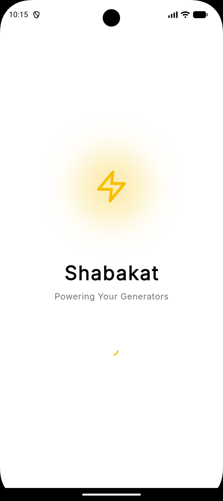
      <br/><em>Splash &amp; auth bootstrap</em>
    </td>
    <td align="center" width="33%">
      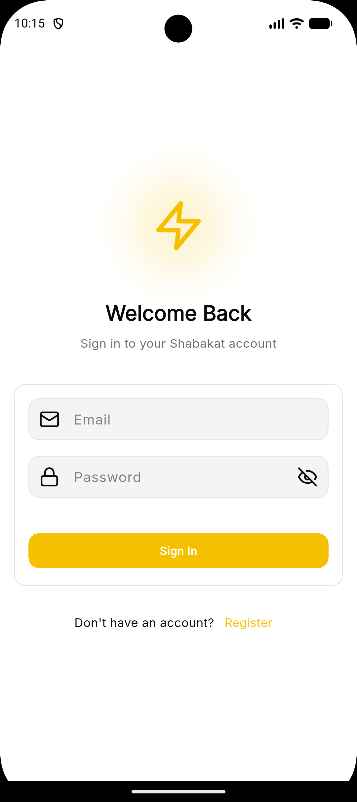
      <br/><em>Secure account login</em>
    </td>
    <td align="center" width="33%">
      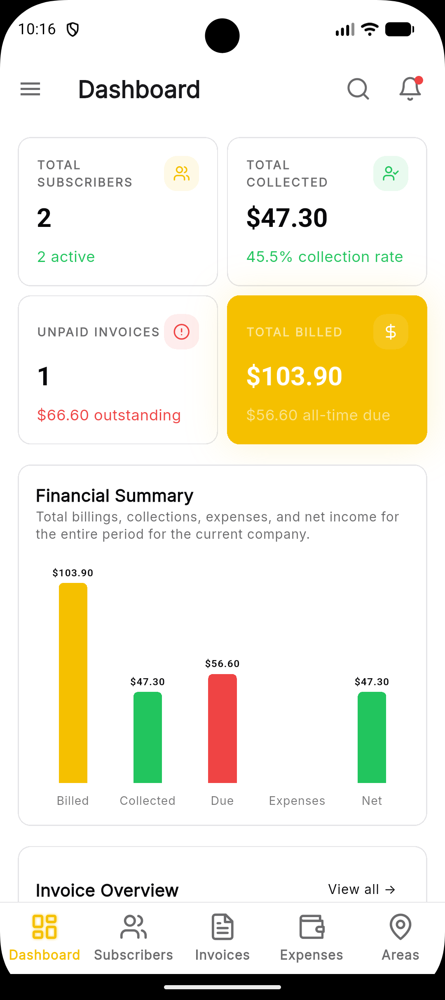
      <br/><em>Financial summary &amp; KPIs</em>
    </td>
  </tr>
  <tr><td colspan="3"><br/></td></tr>
  <tr>
    <td align="center" width="33%">
      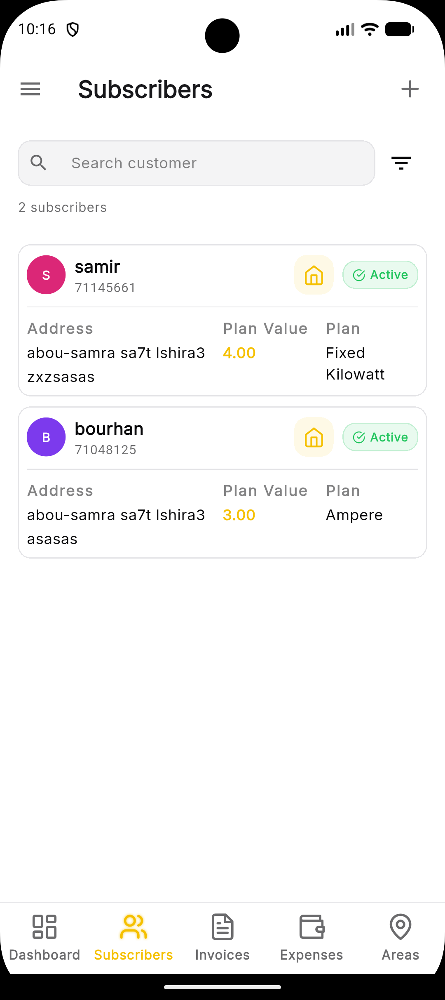
      <br/><em>Search, filter, bulk suspend</em>
    </td>
    <td align="center" width="33%">
      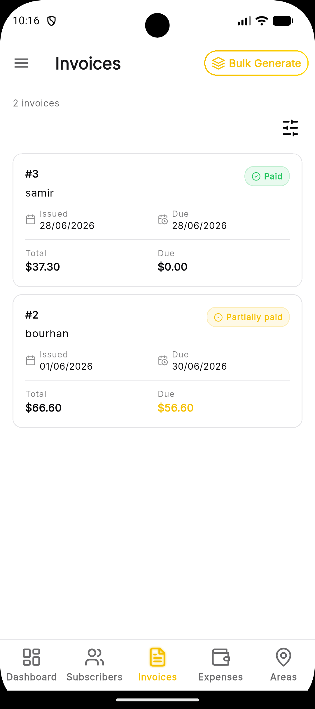
      <br/><em>List, pay, bulk create, PDF</em>
    </td>
    <td align="center" width="33%">
      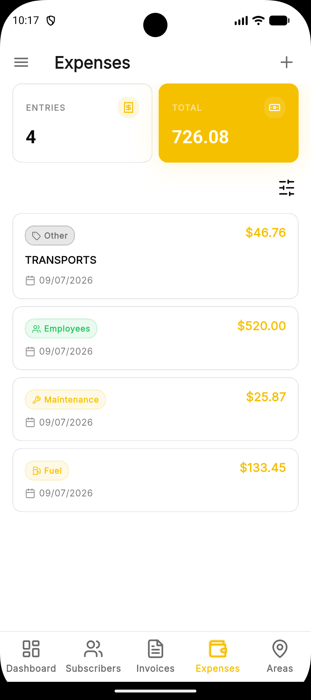
      <br/><em>Fuel, maintenance, payroll tracking</em>
    </td>
  </tr>
  <tr><td colspan="3"><br/></td></tr>
  <tr>
    <td align="center" width="33%">
      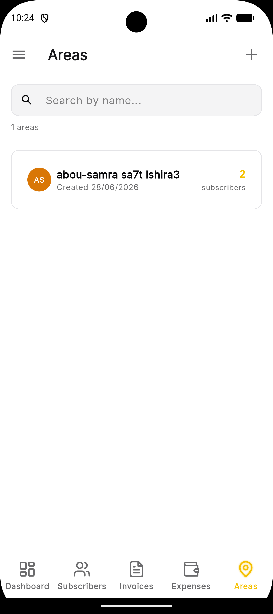
      <br/><em>Geographic zones &amp; subscriber counts</em>
    </td>
    <td align="center" width="33%">
      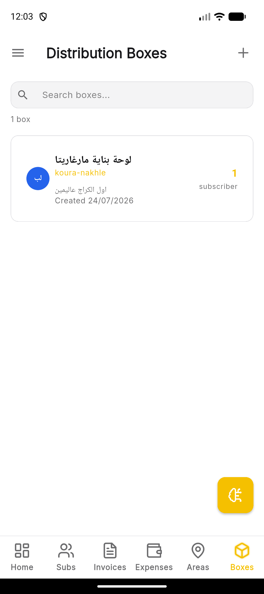
      <br/><em>Physical panels linked to areas</em>
    </td>
    <td align="center" width="33%">
      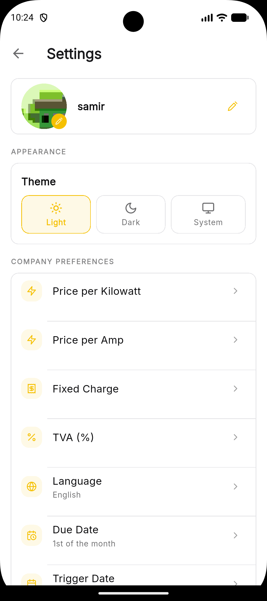
      <br/><em>Pricing, ampere schedules, language</em>
    </td>
  </tr>
  <tr><td colspan="3"><br/></td></tr>
  <tr>
    <td align="center" width="33%">
      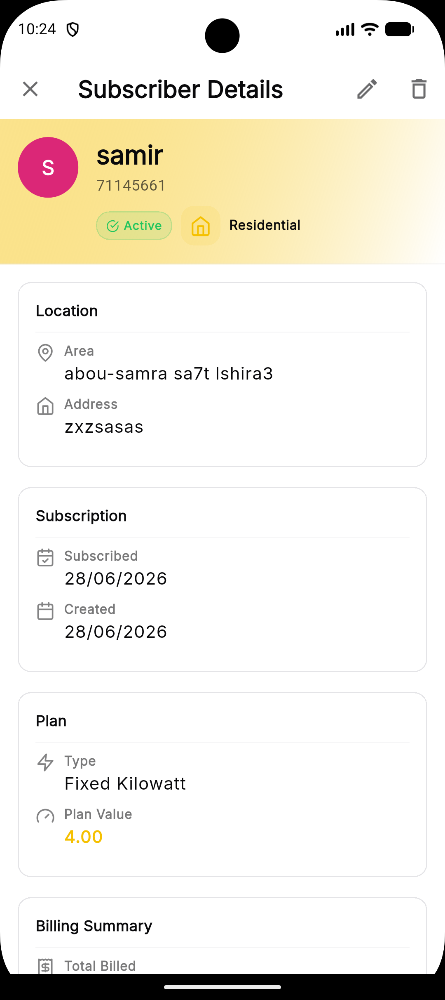
      <br/><em>Invoices, meter readings, edit</em>
    </td>
    <td align="center" width="33%">
      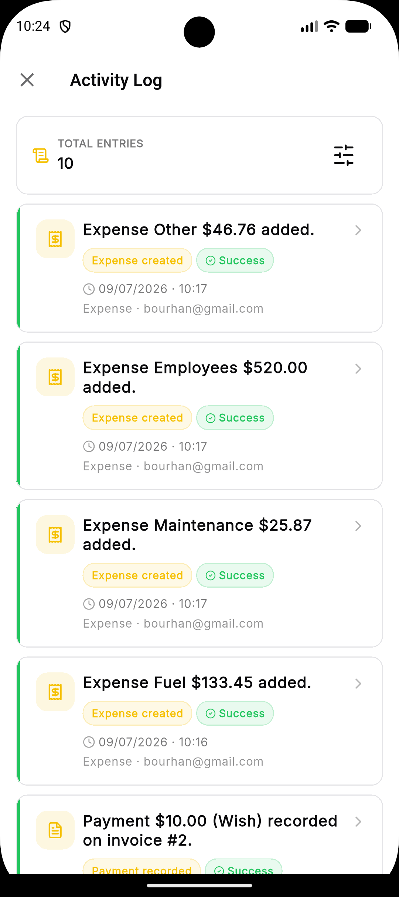
      <br/><em>Activity trail with filters</em>
    </td>
    <td align="center" width="33%">
      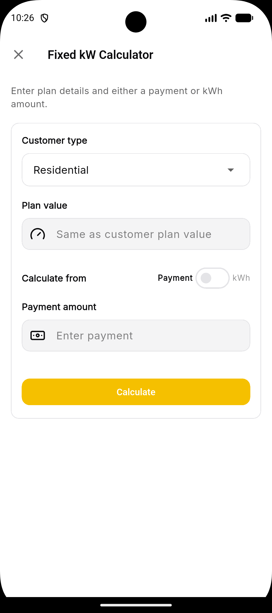
      <br/><em>Fixed kilowatt payment ↔ kWh tool</em>
    </td>
  </tr>
  <tr><td colspan="3"><br/></td></tr>
  <tr>
    <td align="center" width="33%">
      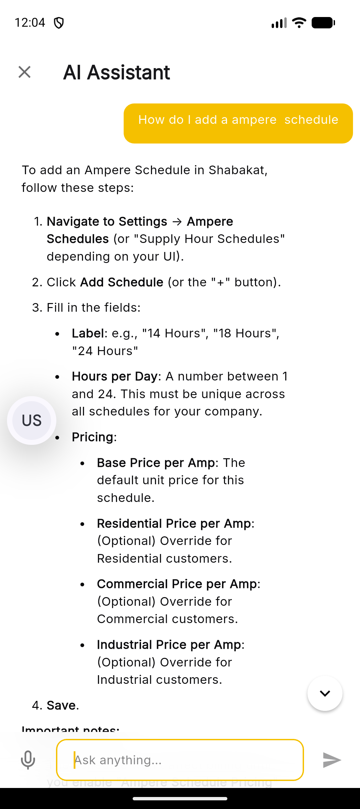
      <br/><em>Streaming AI chat with audio input</em>
    </td>
    <td align="center" width="33%">
      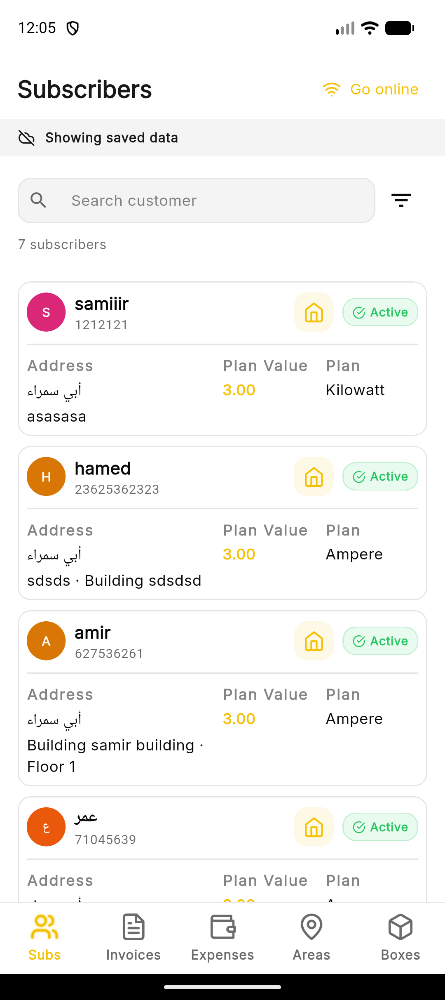
      <br/><em>Browse cached operational data offline</em>
    </td>
    <td width="33%"></td>
  </tr>
</table>

---

## Features

### Authentication & onboarding

- Animated splash screen with session restore
- Email/password **login**
- JWT stored in **Flutter Secure Storage**
- Automatic token injection via `AuthInterceptor`
- App version header injection via `AppVersionInterceptor`
- Session expiry handling with re-login prompt

### Dashboard

- **KPI stat grid** — total subscribers, collected revenue, unpaid invoices, total billed
- **Revenue chart** — billed vs collected vs expenses (fl_chart)
- **Invoice overview** — paid / partially paid / unpaid breakdown
- **Customer & expense breakdown** — active/suspended/terminated, ampere vs kilowatt counts, expense by type
- Custom date-period filtering
- Pull-to-refresh
- Skeleton loading states

### Subscribers (Customers)

- Paginated subscriber list with server-side filters
- **Search inner screen** — filter by name, phone, or area (chip-based criteria)
- **Advanced filters** — plan type, customer relation, status, payment status (paid/unpaid this month)
- Add / edit / delete subscribers
- **Bulk suspend** with multi-select mode
- Per-subscriber **pricing overrides** (price, fixed charge, TVA)
- **Meter readings** for Kilowatt plans (monotonic, one per month)
- Subscriber detail — invoice history, financial totals, status badges
- Area assignment via dedicated area-picker inner screen
- Distribution-box assignment via area-scoped box selector

### Invoices

- Paginated invoice list with status & date filters
- Create single invoice (Ampere / Kilowatt / FixedKilowatt flows)
- **Bulk invoice creation** for all eligible subscribers
- Record payments (Cash, Bank, etc.)
- Edit invoice dates
- **Download and share PDF** invoices from the API
- Share invoice PDFs directly to WhatsApp
- Skipped customers report (missing meter reading, etc.)
- Invoice detail with payment history

### Expenses

- Paginated expense list with date range & type filters
- Summary bar showing **total amount across all pages**
- Add / edit / delete expenses (Owner/Admin)
- Expense types: Fuel, Maintenance, Employees, Other
- Expense detail inner screen

### Areas

- List all geographic areas with subscriber counts
- Local search toolbar
- Add / edit / delete areas (delete blocked when subscribers exist)
- Area detail — subscribers and linked distribution boxes in the zone

### Distribution Boxes

- Physical distribution/junction boxes linked to an area
- Paginated list with name and area filters
- Add, view, edit, and delete distribution boxes
- View linked customers and cables
- Search inner screen with Name / Area chips

### Settings & company configuration

- **Company profile** — name, logo upload (multipart → Cloudflare R2 on API)
- **Pricing preferences**
  - Price per kilowatt / ampere
  - Fixed charge & TVA (VAT %)
  - Per customer-type overrides (residential, commercial, industrial)
- **Ampere schedule tiers** — hours-per-day pricing when schedule pricing is enabled
- Residential, commercial, and industrial pricing per ampere schedule
- Optional day-based ampere invoice proration
- **Due date** & **WhatsApp trigger date** (day-of-month pickers)
- **Trigger message** — custom Arabic payment reminder text
- **Invoice language** — English or Arabic RTL templates
- **Theme** — Light / Dark / System
- **Language** — English / Arabic

### Utilities

- **Fixed Kilowatt Calculator** — convert between payment amount and kWh credit
- **Audit log viewer** — filterable activity trail (Owner/Admin)
- **AI assistant** — streaming Markdown chat with optional recorded audio prompts
- **Read-only offline mode** — sync and browse cached subscribers, invoices, expenses, areas, and distribution boxes
- **Connectivity handling** — online/offline notifications and an offline-mode prompt
- **Offline sync progress** — refresh the local Drift snapshot before disconnecting
- **App drawer** — settings, calculator, offline sync, offline mode, logout

---

## Tech Stack

| Category | Technology | Version |
|----------|------------|---------|
| Framework | Flutter | ≥ 3.35.0 |
| Language | Dart | ^3.11.5 |
| State management | flutter_riverpod + riverpod_generator | ^3.3.1 / ^4.0.3 |
| HTTP client | Dio + awesome_dio_interceptor | ^5.9.2 |
| Immutable models | Freezed + json_serializable | ^3.2.5 |
| Local cache | Drift + sqlite3 | ^2.20.0 |
| Secure storage | flutter_secure_storage | ^10.2.0 |
| Preferences | shared_preferences | ^2.5.5 |
| i18n | easy_localization | ^3.0.8 |
| Charts | fl_chart | ^0.70.2 |
| Icons | lucide_icons, cupertino_icons | — |
| Fonts | google_fonts | ^8.1.0 |
| Loading UX | skeletonizer | ^2.1.3 |
| Images | cached_network_image, image_picker | — |
| Sharing | share_plus | ^13.2.0 |
| WhatsApp sharing | Local `whatsapp_share_fix` plugin | — |
| AI chat | flutter_chat_ui + flutter_markdown_plus | ^2.11.1 / ^1.0.12 |
| Audio prompts | record + just_audio | ^6.1.2 / ^0.10.4 |
| Connectivity | connectivity_plus | ^7.2.0 |
| App metadata | package_info_plus | ^10.2.1 |
| Logging | logger | ^2.7.0 |
| Linting | flutter_lints + riverpod_lint | ^6.0.0 |

---

## Architecture

Shabakat follows **Clean Architecture** with a pragmatic Flutter layout:

```
┌─────────────────────────────────────────────────────────┐
│                      UI Layer                           │
│  Screens · Widgets · Riverpod consumers                 │
│  lib/ui/                                                │
└────────────────────────┬────────────────────────────────┘
                         │ reads / writes
┌────────────────────────▼────────────────────────────────┐
│                     Data Layer                          │
│  Providers (notifiers) · Offline repositories           │
│  lib/data/                                               │
└────────────────────────┬────────────────────────────────┘
                         │ calls
┌────────────────────────▼────────────────────────────────┐
│                     Core Layer                          │
│  Network (Dio, DTOs, services) · Enums · Themes         │
│  lib/core/                                              │
└────────────────────────┬────────────────────────────────┘
                         │ maps to
┌────────────────────────▼────────────────────────────────┐
│                    Domain Layer                         │
│  Entities · Mappers (no implementation deps)            │
│  lib/domain/                                            │
└─────────────────────────────────────────────────────────┘

┌─────────────────────────────────────────────────────────┐
│                 Infrastructor (local cache)              │
│  Drift tables & migrations · lib/infrastructor/         │
└─────────────────────────────────────────────────────────┘
```

### Data flow example

```
UI Screen
  → ref.watch(customerProvider)          // AsyncValue<List<Customer>>
    → CustomerNotifier.build()
      → watches customerFilterProvider
      → online: CustomerService → ApiExecutor → Dio → Electro API
      → offline: CustomerRepo → Drift
      → mapper → Customer entity
```

### Provider conventions

Providers are **state holders only**:

```dart
// ✅ One generic update — UI passes merged state
void update(CustomerFilterRequest next) { ... }

// ❌ No screen-specific methods
void updateSearch(String q) { ... }
```

---

## Project Structure

```
shabakat/
├── assets/
│   ├── logo/                    # App icon & splash assets
│   └── translations/
│       ├── en.json              # English strings
│       └── ar.json              # Arabic strings
├── lib/
│   ├── main.dart                # Entry point, localization, theme
│   ├── core/
│   │   ├── constants/           # AppSizes, API error messages
│   │   ├── enums/               # PlanType, InvoiceStatus, etc.
│   │   ├── exceptions/          # ApiException
│   │   ├── network/
│   │   │   ├── client/          # DioClient, interceptors
│   │   │   ├── dto/             # Request & response Freezed models
│   │   │   ├── executor/        # ApiExecutor (success/failure wrapper)
│   │   │   └── services/        # Per-resource API services
│   │   ├── storage/             # Secure storage wrappers
│   │   ├── themes/              # AppColors, ControlsThemes, ThemeSelector
│   │   └── utilities/           # Formatters, PDF exporter, etc.
│   ├── data/
│   │   ├── providers/           # Riverpod notifiers per feature
│   │   └── repositories/        # Drift-backed offline repositories
│   ├── domain/
│   │   ├── entities/            # Business models (Freezed)
│   │   └── mappers/             # DTO ↔ Entity extensions
│   ├── infrastructor/           # Drift local cache and migrations
│   └── ui/
│       ├── ai/                  # Streaming AI assistant
│       ├── offline_mode/        # Read-only cached-data navigation
│       ├── screens/             # Feature screens & subscreens
│       ├── settings/            # Settings & preferences UI
│       ├── shared/              # Reusable widgets, dialogs, skeletons
│       └── splash/              # Splash screen
├── android/ · ios/ · windows/ · macos/ · linux/   # Platform runners
├── test/                        # Widget & unit tests
├── analysis_options.yaml
├── pubspec.yaml
├── AGENTS.md                    # AI agent / contributor conventions
└── shabakat_endpoints_documentation.md   # Backend API reference
```

---

## Getting Started

### Prerequisites

| Tool | Version |
|------|---------|
| Flutter SDK | ≥ 3.35.0 |
| Dart SDK | ^3.11.5 |
| Android Studio / Xcode | For mobile targets |
| VS Code or Android Studio | Recommended IDE with Flutter & Dart plugins |

Verify your environment:

```bash
flutter doctor -v
```

### Installation

```bash
# Clone the repository (replace URL with your actual remote)
git clone https://github.com/your-org/shabakat.git
cd shabakat

# Install dependencies
flutter pub get
```

### API Configuration

The backend base URL is configured in `lib/core/network/client/dio_client.dart`. The current production target is:

```dart
baseUrl:
    'https://electro-production-9f56.up.railway.app/api/v1.0/$endpoint',
```

For **local development**, swap that for one of the commented alternatives:

```dart
// baseUrl: 'https://10.0.2.2:7076/api/v1.0/$endpoint',   // Android emulator
// baseUrl: 'https://192.168.1.2:7076/api/v1.0/$endpoint', // Physical device on LAN
```

> The client currently accepts self-signed certificates in development (`badCertificateCallback`). **Remove or restrict this before production release.**

API documentation for all endpoints lives in [`shabakat_endpoints_documentation.md`](./shabakat_endpoints_documentation.md).

| Setting | Value |
|---------|-------|
| Base path | `/api/v1.0` |
| Auth | `Authorization: Bearer <JWT>` |
| Content-Type | `application/json` |
| Enum format | JSON strings (`"Ampere"`, not `0`) |
| Errors | RFC 7807 Problem Details |

### Code Generation

Shabakat relies on code generation for **Freezed**, **json_serializable**, and **riverpod_generator**. Run after any model or provider change:

```bash
dart run build_runner build --delete-conflicting-outputs
```

Watch mode during active development:

```bash
dart run build_runner watch --delete-conflicting-outputs
```

Generated files (`*.g.dart`, `*.freezed.dart`) are excluded from analyzer linting.

### Run the App

```bash
# List available devices
flutter devices

# Run on default device (debug)
flutter run

# Run on a specific device
flutter run -d chrome
flutter run -d windows
flutter run -d <device-id>
```

---

## Development

### State Management

| Pattern | Usage |
|---------|-------|
| `@Riverpod` class notifiers | Feature lists (customers, invoices, areas…) |
| Filter providers | Separate `*FilterProvider` + `*PaginationProvider` for list screens |
| `keepAlive: true` | Services and auth survive tab switches |
| `ref.watch` in `build()` | Auto-refetch when filter changes |
| `AsyncValue.when` | Loading / error / data UI branches |
| `skipLoadingOnRefresh: true` | Keep content visible during pull-to-refresh |

### Networking

```
DioClient
  ├── AuthInterceptor      → attaches Bearer token
  ├── AppVersionInterceptor → attaches client version
  ├── RetryInterceptor     → retries failed requests (max 2)
  └── AwesomeDioInterceptor → debug logging
```

Services live in `lib/core/network/services/<feature>/` and are consumed by data-layer providers. All API calls go through `ApiExecutor`, which normalizes responses into `success` / `failure` unions.

### Theming & UI Conventions

| Rule | Location |
|------|----------|
| Colors | `lib/core/themes/app_colors.dart` |
| Gradients | `lib/core/themes/app_gradients.dart` |
| Component themes | `lib/core/themes/controls_themes.dart` |
| ThemeData assembly | `lib/core/themes/theme_selector.dart` |
| Spacing & breakpoints | `AppSizes` extension on `BuildContext` |

**In widgets:** always use `Theme.of(context)` — never `Colors.xxx` or hardcoded hex values.

### Localization

- Files: `assets/translations/en.json`, `assets/translations/ar.json`
- Access: `'key.path'.tr()` via `easy_localization`
- RTL: handled automatically when locale is `ar`
- Language preference persisted in `SharedPreferences`

Add a new string:

```json
// en.json
"my_feature": {
  "title": "My Feature"
}
```

```dart
Text('my_feature.title'.tr())
```

### Inner Screens Pattern

Modal full-screen flows (add, edit, search, filters) use a slide-up transition:

```dart
Navigator.of(context).push(
  openInnerScreen(widget: const SubscriberAddingScreen()),
);
```

Defined in `lib/ui/shared/inner_screens/dynamic_inner_screen.dart`.

---

## Modules Reference

| Module | Screen | Provider(s) | Service |
|--------|--------|-------------|---------|
| Auth | `login/` | `auth_provider` | `auth_service` |
| AI assistant | `ui/ai/` | `ai_chat_provider` | `ai_service` |
| Dashboard | `dashboard/` | `dashboard_provider` | `dashboard_service` |
| Subscribers | `subscribers/` | `customer_provider`, `customer_filter_provider`, `customer_pagination_provider`, `customer_selection_provider`, `single_customer_provider` | `customer_service` |
| Meter readings | subscriber detail | `meter_reading_provider` | `meter_reading_service` |
| Invoices | `invoices/` | `invoice_provider`, `invoice_filter_provider`, `invoice_pagination_provider`, `single_invoice_provider` | `invoice_service` |
| Expenses | `expenses/` | `expense_provider`, `expense_filter_provider`, `expense_pagination_provider`, `single_expense_provider` | `expense_service` |
| Areas | `areas/` | `area_provider` | `area_service` |
| Distribution boxes | `distribution_box/` | `distribution_box_provider`, `distribution_box_filter_provider` | `distribution_box_service` |
| Offline mode | `ui/offline_mode/` | `offline_mode_provider`, `syncing_progress` | Drift repositories |
| Ampere schedules | settings | `ampere_schedule_provider` | `ampere_schedule_service` |
| Company | settings | `company_provider`, `company_profile_provider` | `company_service` |
| Audit logs | `audit/` | `audit_log_provider`, `audit_log_filter_provider`, `audit_log_pagination_provider` | `audit_log_service` |
| Network | global | `internet_connection_provider` | — |

---

## Supported Billing Plans

| Plan | Description | Meter required |
|------|-------------|----------------|
| **Ampere** | Fixed amp subscription; optional schedule-based hourly pricing | No |
| **Kilowatt** | Metered consumption; invoice from reading delta | Yes |
| **FixedKilowatt** | Prepaid kWh credit from fixed payment | Calculator tool |

Customer types: **Residential**, **Commercial**, **Industrial** — each can have pricing overrides at company or per-customer level.

---

## User Roles

Roles are enforced server-side. The API returns 403 for unauthorized actions.

| Role | Capabilities |
|------|-------------|
| **Owner** | Everything including WhatsApp disconnect, company profile |
| **Admin** | Bulk invoices, delete, expenses, audit logs, suspend |
| **User** | Standard read/write for daily operations |

---

## Testing

```bash
# Run all tests
flutter test

# Run with coverage
flutter test --coverage

# Analyze static issues
flutter analyze

# Analyze a specific module
flutter analyze lib/ui/screens/distribution_box
```

---

## Build & Release

```bash
# Android APK
flutter build apk --release

# Android App Bundle (Play Store)
flutter build appbundle --release

# iOS (requires macOS + Xcode)
flutter build ios --release

# Windows
flutter build windows --release
```

### Launcher icon & splash

Configured in `pubspec.yaml` under `flutter_launcher_icons` and `flutter_native_splash`. Regenerate after asset changes:

```bash
dart run flutter_launcher_icons
dart run flutter_native_splash:create
```

---

## License

**Proprietary — All Rights Reserved.**

This software and its source code are confidential. Unauthorized copying, distribution, modification, or use of this software, via any medium, is strictly prohibited without prior written consent from the copyright holder.

---

<p align="center">
  <sub>Built with ⚡ for local electricity providers · Shabakat v1.0.0</sub>
</p>
